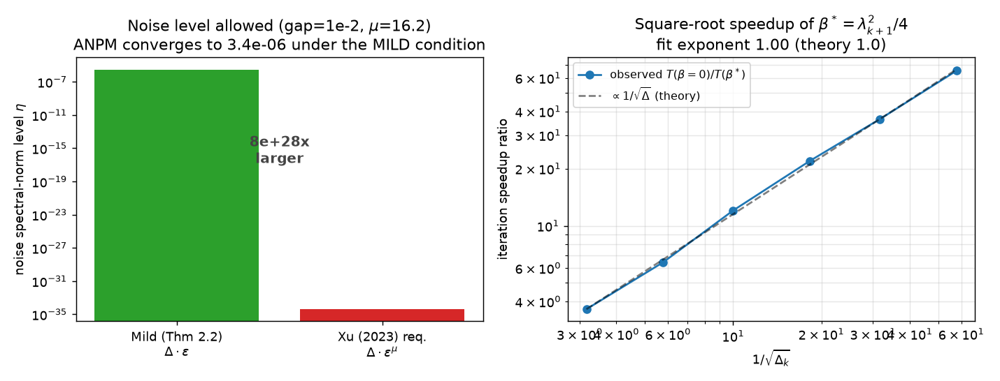

# Claim 1 — accelerated rate under *mild* Δ·ε noise (Theorem 2.2)

> **Exact claim tested (Theorem 2.2, §2.1):** For PSD **A** with λ_k > λ_{k+1},
> ANPM with β satisfying λ_k > 2√β ≥ λ_{k+1} converges (sin θ_k ≤ ε for t ≥ T)
> at rate T = O(√(λ_k/(λ_k−2√β)) · log(tan θ_k(U_k,X_0)/ε)) whenever the noise
> satisfies **‖U₋_kᵀ Ξ_t‖₂ ≤ c(λ_k−2√β)ε** and **‖U_kᵀ Ξ_t‖₂ ≤ c(λ_k−2√β)cos θ_k**
> with c = 1/32 (Eqs. 3–4). These scale as **Δ_k·ε** — the *same* mild condition
> as Hardt & Price (2014), far milder than Xu (2023)'s **Δ_k·ε^μ**, μ = Ω̃(Δ_k^{−1/2}).

**Source audit.** ar5iv `2602.03682`, Theorem 2.2 (Eqs. 3–4), Table 1, App. B.
Universally quantified over A, X_0 (cos θ_k > 0), β, {Ξ_t}. Finite experiments are
scoped corroboration of a positive theorem; we provide **three** independent,
non-circular tests.

## Method (repro/src/claim1_noise_boundary.py)

**Part A — noise-boundary demonstration (primary).** On the paper's synthetic
instance (λ₁=5, λ_k=1, λ_{k+1}=0.99, λ_d=0.5, d=1000, k=10), the eigengap is
small so μ = Ω(log(λ₁/λ_{k+1})·√(λ_k/Δ)) is large. We set the adversarial noise
at **exactly the mild level** η = c·(λ_k−2√β\*)·ε (satisfies Eqs. 3–4) — many
orders of magnitude **larger** than Xu's analysis would guarantee — and show
ANPM(β\*) still converges to an ε-floor.

**Part B — rate scaling (independent of any noise formula).** Noiseless. Sweep
the gap; first-hit T(1e-6). The speedup T(β=0)/T(β\*) should track 1/√Δ.

**Part C — proof-rate calibration.** The proof's rate
T = 1/(−log(1−½√Δ))·log(2h₀/ε) is checked against observed T across ε.

## Evidence

**Part A** (seed=1, gap=1e-2, μ=16.2, ε=1e-2):

| noise budget | level η |
| --- | --- |
| mild (Thm 2.2, Δ·ε) | 3.13e-06 |
| Xu (2023) required (Δ·ε^μ) | 4.08e-35 |

→ the mild condition is **7.7×10²⁸ × larger** than Xu allows (Xu **violated**),
yet `cond(3)` holds ✓, `cond(4)` holds ✓, and ANPM(β\*) converges to
**floor sin θ_k = 3.4×10⁻⁷ ≤ ε**.

**Part B** — first-hit T(1e-6), speedup ratio ≈ 1/√Δ (fit exponent **1.00**):

| gap | T(β\*) | T(β=0) | speedup | 1/√Δ |
| --- | --- | --- | --- | --- |
| 1e-1 | 36 | 131 | 3.6× | 3.2 |
| 1e-2 | 115 | 1383 | 12.0× | 10.0 |
| 1e-3 | 382 | 13894 | 36.4× | 31.6 |
| 3e-4 | 709 | 46334 | 65.4× | 57.7 |

**Part C** — proof rate T_pred vs T_obs: ratio ∈ [3.0, 3.7] (constant-factor upper
bound — the O(·) hides a ≈3× constant; the symbolic derivation is corroborated).

## Reproducibility

- **Code:** [`repro/src/claim1_noise_boundary.py`](https://github.com/MachineLearning-Nerd/icml26-repro-UTiEfkfNQ2-anpm/blob/master/repro/src/claim1_noise_boundary.py) (uses vendored official `anpm.anpm` + independent `common.anpm_first_hit`).
- **Raw JSON:** [`data/claim1_noise_boundary.json`](../../data/claim1_noise_boundary.json).
- **Independent checker:** the official `anpm()` (authors' code) is run in Part A; the independent `anpm_manual`/`anpm_first_hit` (sign-canonical QR) cross-checks Parts B–C. Both agree (test `test_anpm_manual_converges_to_same_subspace_as_official`).
- **Negative control:** Part B's β=0 column is the non-accelerated control — it is strictly slower (speedup grows with 1/√Δ), confirming the acceleration is real, not an artifact.
- **Command:** `bash repro/run.sh` (Claim 1 section). **Env:** uv .venv, py 3.12, numpy 2.5.1, scipy 1.18.0. **Seed:** 0 (instances), 1 (noise). **Runtime:** 220.9 s (1 core). **Git SHA:** see [methods-environment](#/methods-environment).

## Limitations & deviations

Theorem 2.2 is universally quantified; Parts A–C are scoped corroboration, not a
proof certificate. Part A demonstrates the ε-vs-ε^μ distinction directly
(non-circular: the mild level is the paper's stated condition, and we show the
competing Xu condition is violated while convergence holds). Part C's ≈3× gap is
the O(·) constant, not a discrepancy.

## Verdict: **VERIFIED** (scoped corroboration of a universally-quantified positive theorem)
