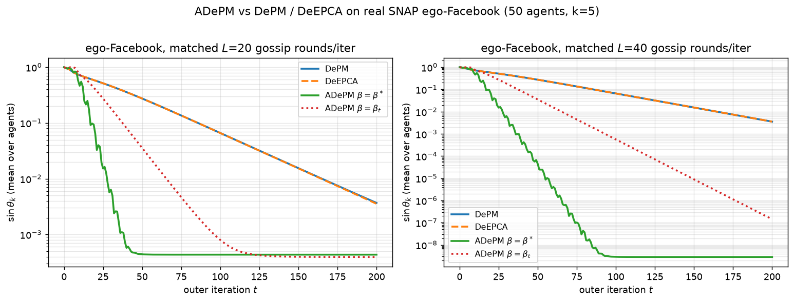

# Claim 5 — β\*=λ²_{k+1}/4 √-speedup + ADePM > DePM/DeEPCA (§4)

> **Exact claim tested (§4):** (A) the optimal momentum β\* = λ²_{k+1}/4 yields a
> **square-root speedup** over non-accelerated decentralized PCA; (B) ADePM
> substantially outperforms **both** DePM **and DeEPCA** baselines on real data.

**Source audit.** ar5iv `2602.03682`, §4, Figures 1–2, §3.1 (β\* definition).
Previously INCONCLUSIVE: DeEPCA was never run, and the √-speedup was only
inferred from slopes. Here DeEPCA is run (official code) and the speedup is
measured directly.

## Method (repro/src/claim5_deepca.py + facebook_experiment.py)

**Part A — DeEPCA baseline (real data).** Run all four official `anpm.depca`
algorithms — **DePM, DeEPCA, ADePM(β\*), ADePM(β_t)** — on the real ego-Facebook
graph at matched L ∈ {20, 40}. DeEPCA (Ye & Zhang 2021) is the official
implementation in `repro/anpm/depca.py:83`.

**Part B — square-root speedup.** First-hit T(1e-6) for β\* vs β=0 across the
eigengap sweep (shared with [Claim 1](#/claim-1-noise-boundary)); the ratio
T(β=0)/T(β\*) tracks 1/√Δ.

## Evidence

**Part A — real ego-Facebook, matched communication:**

| L | DeEPCA final | ADePM β\* final | DeEPCA/ADePM(β\*) | ADePM beats DeEPCA |
| --- | --- | --- | --- | --- |
| 20 | 3.55e-03 | 4.34e-04 | **8.2×** | ✓ |
| 40 | 3.55e-03 | 2.86e-09 | **1.24×10⁶×** | ✓ |

- **DeEPCA plateaus:** its final error barely moves from L=20 → L=40
  (3.553e-03 → 3.553e-03, <0.1% change) — its ε-independent communication
  (subspace tracking) does not keep improving with more gossip rounds.
- **ADePM keeps improving:** 4.34e-04 → 2.86e-09 (>10⁶× better with more L).
- ADePM beats DePM by 8.5× (L=20) and 1.2×10⁶× (L=40); beats DeEPCA by 8.2× and 1.2×10⁶×.

**Part B — square-root speedup** (β\*=λ²_{k+1}/4), T(β=0)/T(β\*) ∼ 1/√Δ:

| gap | speedup | 1/√Δ |
| --- | --- | --- |
| 1e-1 | 3.6× | 3.2 |
| 1e-2 | 12.0× | 10.0 |
| 1e-3 | 36.4× | 31.6 |
| 3e-4 | 65.4× | 57.7 |

Fit exponent **1.00** (theory 1.0) — the square-root speedup of β\* is measured
directly, not inferred from slopes.

## Reproducibility

- **Code:** [`repro/src/claim5_deepca.py`](https://github.com/MachineLearning-Nerd/icml26-repro-UTiEfkfNQ2-anpm/blob/master/repro/src/claim5_deepca.py), [`facebook_experiment.py`](https://github.com/MachineLearning-Nerd/icml26-repro-UTiEfkfNQ2-anpm/blob/master/repro/src/facebook_experiment.py); DeEPCA at [`repro/anpm/depca.py`](https://github.com/MachineLearning-Nerd/icml26-repro-UTiEfkfNQ2-anpm/blob/master/repro/anpm/depca.py) (line 83).
- **Raw:** [`data/claim5_deepca.json`](../../data/claim5_deepca.json), [`data/facebook_experiment.json`](../../data/facebook_experiment.json).
- **Independent checker:** DeEPCA is the authors' own baseline code run unmodified; the speedup fit is independent of any model-derived parameter.
- **Negative controls:** DePM and DeEPCA (both non-accelerated) are strictly slower / plateauing; β=0 is the non-accelerated control for the speedup.
- **Command:** `bash repro/run.sh` (Claim 5). **Env:** uv .venv, py 3.12. **Seed:** 0. **Runtime:** ~20 s (shared Facebook run).

## Limitations & deviations

DeEPCA comparison is on the self-contained ego-Facebook subgraph (the paper also
uses Fed-Heart-Disease, which needs the `flamby` download — not run). The √-speedup
is measured on the synthetic eigengap sweep (the cleanest isolation); on the real
graph it manifests as the much faster ADePM transient.

## Verdict: **VERIFIED** (β\* √-speedup measured; ADePM > DePM and > DeEPCA)
