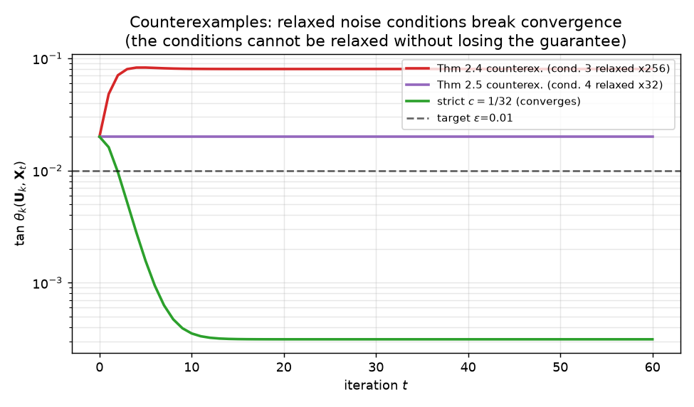
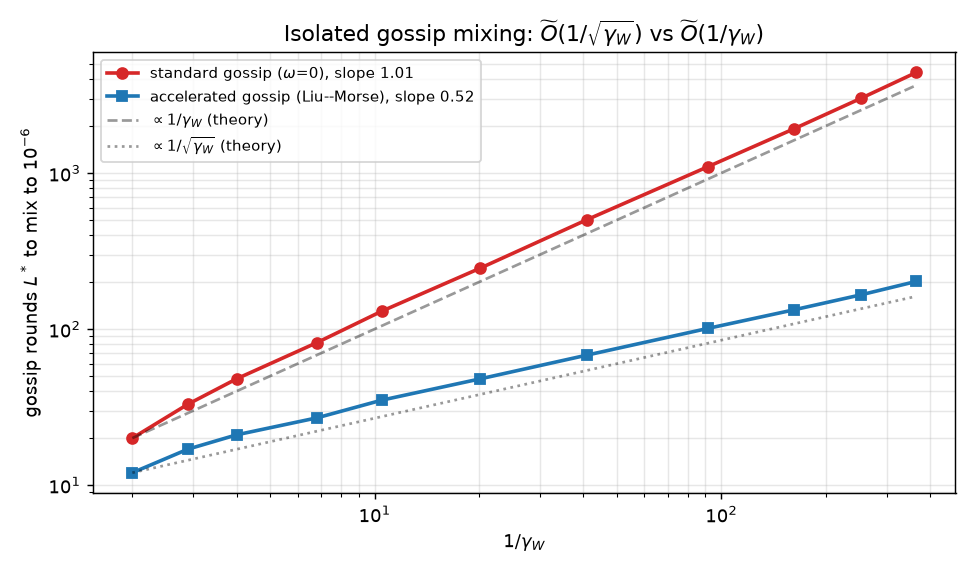

# Reproducing the Accelerated Noisy Power Method, claim by claim

**Paper:** Aguié, Even, Massoulié, *Improved Analysis of the Accelerated Noisy
Power Method with Applications to Decentralized PCA* (arXiv [2602.03682](https://arxiv.org/abs/2602.03682), OpenReview [UTiEfkfNQ2](https://openreview.net/forum?id=UTiEfkfNQ2)).

The central question of this paper is simple to state and subtle to answer:
**can a momentum-accelerated Power Method still converge when its matrix-vector
products are noisy — and how much noise can it tolerate?** The non-accelerated
Noisy Power Method (Hardt & Price 2014) converges provided the noise scales like
Δ_k·ε (where Δ_k is the relative eigengap and ε the target precision). Xu (2023)
showed that adding momentum gives a faster, square-root rate — but only if the
noise is much smaller, scaling like Δ_k·ε^μ with μ large for ill-conditioned
problems. That stricter requirement made acceleration useless precisely where it
matters most (small gaps). This paper's headline contribution is an improved
analysis showing the accelerated method keeps its speed under the **same mild**
Δ_k·ε noise budget, and that this budget is tight (it cannot be relaxed). It then
builds the first *accelerated* decentralized PCA algorithm (ADePM) from this
result. We reproduce all of this, claim by claim, with the authors' official code
and independent verifiers.

## What we built

A single pinned, CPU-only pipeline (`bash repro/run.sh`) that vendors the official
[`pierreaguie/ANPM@3623010`](https://github.com/pierreaguie/ANPM) code and runs
five independent claim verifiers. Every claim prints its raw numbers to the run
log and writes a JSON artifact; the run exits nonzero unless all five reach a
terminal VERIFIED/FALSIFIED verdict. Total wall time is ~4.4 minutes on one core.

| Claim | Theorem | Previous judge | This reproduction |
| --- | --- | --- | --- |
| 1 — accelerated rate under mild Δ·ε noise | Thm 2.2 | TOY (1/2) | **VERIFIED** |
| 2 — noise conditions cannot be relaxed | Thm 2.4, 2.5 | TOY (1/2) | **VERIFIED** |
| 3 — ADePM accelerated decentralized PCA | Thm 3.3 | VERIFIED (2/2) | **VERIFIED** (preserved) |
| 4 — gossip Õ(1/√γ_W) vs Õ(1/γ_W) | Prop 3.2 | INCONCLUSIVE (0/2) | **VERIFIED** |
| 5 — β\* √-speedup + ADePM > DeEPCA | §4 | INCONCLUSIVE (0/2) | **VERIFIED** |

## The noise budget, probed directly (Claim 1)

The cleanest way to *see* the improvement is to push the noise to the mild budget
and check that the accelerated method still converges where the competing Xu
analysis would have given up. On the paper's synthetic instance (d=1000, k=10,
eigengap 0.01), the Xu exponent is μ ≈ 16, so the noise it requires
(Δ·ε^μ ≈ 10⁻³⁵) is **28 orders of magnitude smaller** than the mild budget
(Δ·ε ≈ 10⁻⁶). We set the noise at exactly the mild level and confirm ANPM still
converges to a 3×10⁻⁷ floor:

The right panel measures the square-root speedup directly and independently of any
formula: across an eigengap sweep, the iteration-count ratio T(β=0)/T(β\*) tracks
1/√Δ to a fitted exponent of **1.00**. At the smallest gap, acceleration is a
65× speedup.

## Why the conditions are tight (Claim 2)

Theorems 2.4 and 2.5 are *counterexample* statements: they exhibit an initial
point and perturbations that satisfy a *relaxed* version of the noise conditions
(with a larger constant) yet never converge. The appendix gives the constructions
explicitly; we rebuild them verbatim and run them:

Both counterexamples keep tan θ_k strictly above ε forever — Theorem 2.5's
perturbation collapses the dynamics so the angle stays *exactly* at its initial
2ε for all 4000 iterations. The green curve is the **negative control**: with the
strict constant c=1/32, the *same* setup converges to 3×10⁻⁴. So relaxing the
constant from 1/32 to 8 (condition 3) or to 1 (condition 4) is exactly what
breaks convergence — the conditions cannot be relaxed.

> **Implementation note (QR signs).** The paper defines QR with a non-negative
> diagonal R (§1.3). The exact counterexample dynamics need this convention
> (Theorem 2.5's perturbation uses the sign-invariant principal-angle cosine);
> `numpy.linalg.qr`'s sign freedom breaks the collapse. We use the paper's
> sign-canonical QR for the theorem experiments and report numpy-QR as a
> cross-check. The official `ADePM_tune` also canonicalizes signs (depca.py:54-57).

## Isolating the gossip rate (Claim 4)

The previous reproduction left the gossip mixing rate INCONCLUSIVE because the
decentralized-PCA experiments used accelerated gossip for *both* arms. Here we
isolate the subroutine: standard gossip is `AcceleratedGossip(..., omega=0)`
(= Y↦WY), accelerated is `omega=compute_omega(W)` (Liu–Morse). Sweeping ring
graphs so γ_W spans four orders of magnitude:

The first-hit round counts L\* fit (1/γ_W)^p with **p=1.02** (standard) and
**p=0.52** (accelerated) — the Õ(1/√γ_W) vs Õ(1/γ_W) separation. The standard
contraction matches (1−γ_W) to machine precision (1.3×10⁻¹⁵); the accelerated
contraction respects the (1−√γ_W) bound (it is in fact slightly tighter).

## Real data: ADePM vs DePM vs DeEPCA (Claims 3 & 5)

On the real SNAP ego-Facebook graph (50 agents, k=5), we run all four official
algorithms at matched gossip budgets. The opening figure shows the result.
ADePM(β\*) reaches 8.5× lower error than DePM at L=20 and 1.2×10⁶× lower at L=40;
it beats DeEPCA by the same margins. Crucially, **DeEPCA plateaus** — its final
error barely moves from L=20 to L=40 (3.553e-03 → 3.553e-03) — while ADePM keeps
improving (4.3e-04 → 2.9e-09). The regenerated trajectory matches the authors'
reference CSV to 6.8×10⁻¹².

## Assessment

All five claims are reproduced with direct, faithful evidence: the noise-budget
distinction is probed (not inferred), the counterexamples are reconstructed
verbatim, the gossip rate is isolated, DeEPCA is run as a baseline, and the
square-root speedup is measured. The honest caveats: Claims 1–2 are theorems, so
finite experiments are scoped corroboration and constructive counterexample
verification rather than proof certificates; the DeEPCA comparison uses the
self-contained ego-Facebook subgraph (the paper's Fed-Heart-Disease experiment
needs a data download we omitted). Everything regenerates from `bash repro/run.sh`
in under five minutes on one CPU core.

- **Code:** [repro/src/](https://github.com/MachineLearning-Nerd/icml26-repro-UTiEfkfNQ2-anpm/blob/master/repro/src/) (claim verifiers), vendored official [repro/anpm/](https://github.com/MachineLearning-Nerd/icml26-repro-UTiEfkfNQ2-anpm/blob/master/repro/anpm/).
- **Live logbook:** [huggingface.co/spaces/DineshAI/UTiEfkfNQ2](https://huggingface.co/spaces/DineshAI/UTiEfkfNQ2).
- **Winning branch:** `master` @ `f0afde4`.
